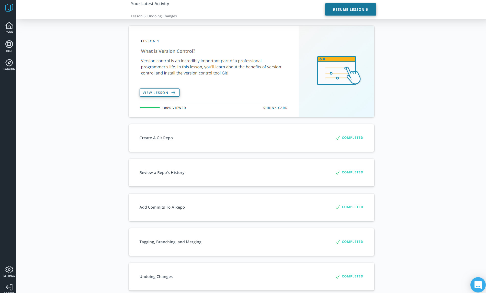
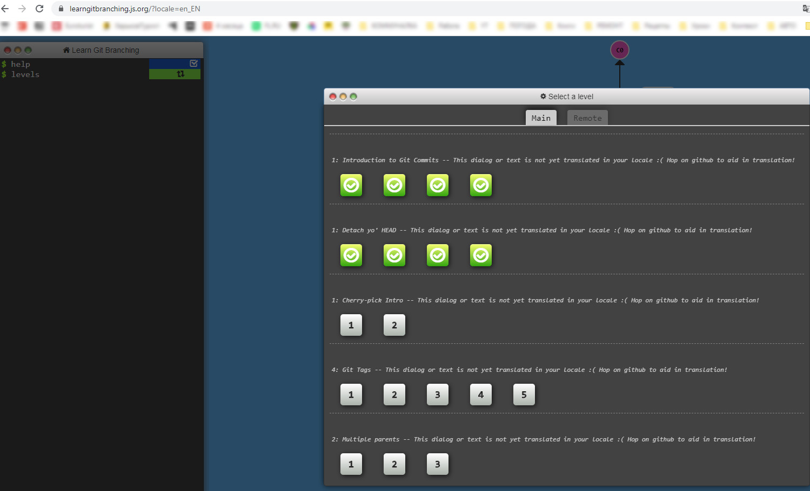
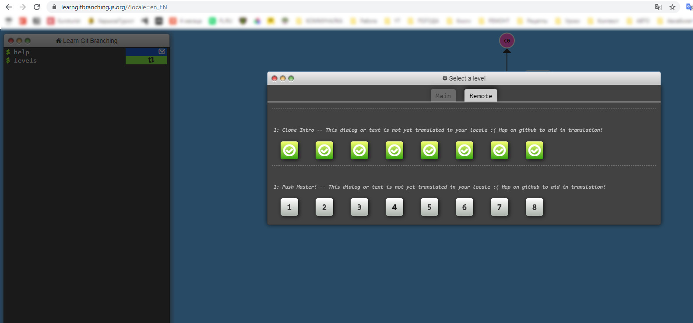
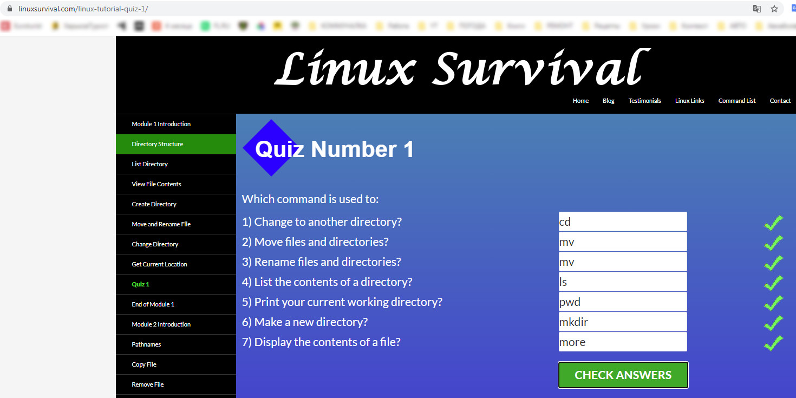
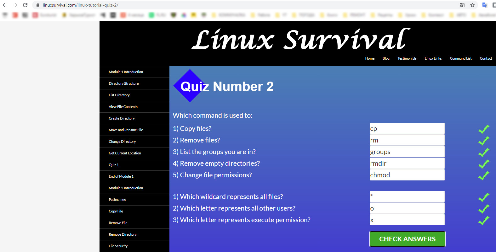
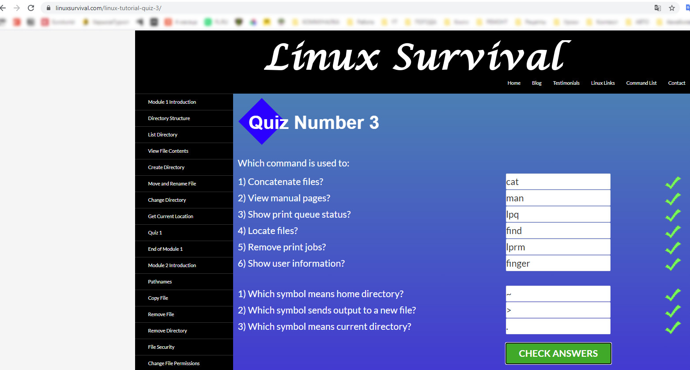
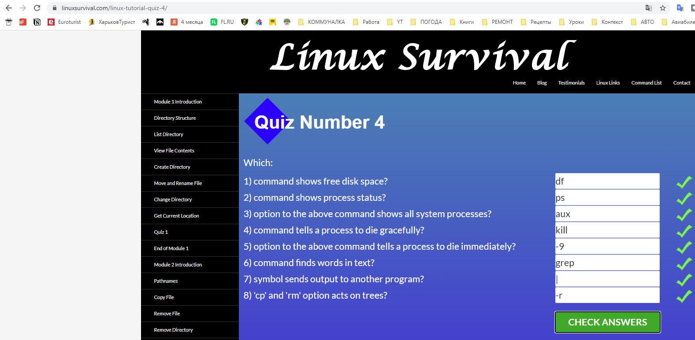
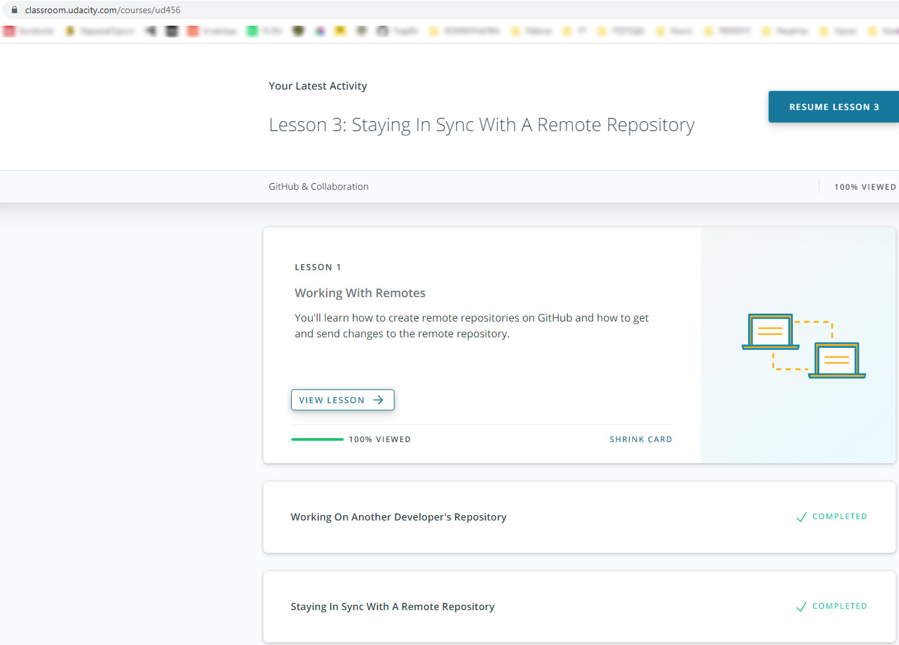
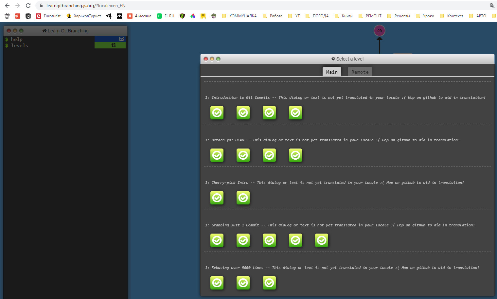
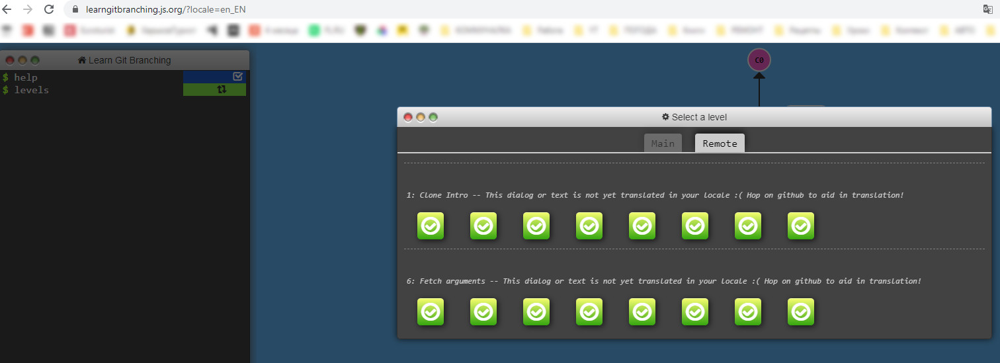

# Kottans-frontend course
### Task list "Stage 0 - Self study"
Preparatory stage of _Front-End Course_.

### General
 - [x] [0. Git Basics](https://github.com/Tsapfik/kottans-frontend#git-basics)
 - [x] [1. Linux CLI and Networking](https://github.com/Tsapfik/kottans-frontend#linux-cli-and-http)
 - [x] [2. VCS (hello gitty), GitHub and Collaboration](https://github.com/Tsapfik/kottans-frontend#git-collaboration)

### Front-End Basics
 - [ ] 3. Intro to HTML & CSS
 - [ ] 4. Responsive Web Design
 - [ ] 5. HTML & CSS Practice
 - [ ] 6. JavaScript Basics
 - [ ] 7. Document Object Model

### Advanced Topics
- [ ] 8. Building a Tiny JS World (pre-OOP)
- [ ] 9. Object oriented JS
- [ ] 10. OOP exercise
- [ ] 11. Offline Web Applications
- [ ] 12. Memory pair game
- [ ] 13. Website Performance Optimization
- [ ] 14. Friends App

## Git Basics

Absolutly everything on this course is new to me. Even markdown on github :) I didn't use any CVS before.

It was cool to find out that almost all breaks can be corrected by referring to the log and managing commits.  It is important not to break anything while you are studying :)

 ### Git basics results

 
 Result screenshots 

### Git Notes

 
 Spoiler 

 
`git init` - the command that will do all of the initial setup of a repository

`ls` - used to list files and directories

`mkdir` - used to create a new directory

`touch <file.name>` - creating a file

`mv <file> <directory>` - moving files to directories
 
`cd` - used to change directories

`rm` - used to remove files and `-r` flag fordeleting directories

`git status`
`git log` - shows us the history of commits
`git log --oneline` - shows us only headers of commits
`git log --stat`
`git log -p` - shows what changes was made (added and removed code) flag `-w` ignoring whitespaces (пустые строки с пробелами)

To scroll **down**, press
- `j` or `↓` to move *down* one line at a time
- `d` to move by half the page screen
- `f` to move by a whole page screen

to scroll **up**, press
- `k` or `↑` to move _up_ one line at a time
- `u` to move by half the page screen
- `b` to move by a whole page screen
press `q` to **quit** out of the log (returns to the regular command prompt)

`git add <file1> <file2>` - add files to the staging index (`git add .`  - add all files and nested directories

`git commit -m "text"` - make a commit withjut opening editor

`git commit -am "text"` - add and commiting all files, which being changed

`git commit --amend` - modify last commit. Change last file → `git add` → `git commit --amend`

`git revert`

`git reset`

`git reflog`

`git diff` - shows untracked changes into the files before staging file

`git tag -a <tag>` - add tag to specific commit

`git branch` - show us all branches

`git branch <name>` - create a new branch

`git checkout -b <branch> <from where>` - create a new branch  "branch" on commit "from where"

`git branch -d(D) <name>` - delete branch (forced delete)

`git log --oneline --graph --all` - show us tree of commits with branches

`git fetch` - pull branches from online repository

`git reset <HEAD/fileName>` - clear indexed files and let to add all new files for commiting again

**Back to normal** - variant to reset to previous version

`$ git checkout -- index.html`

`$ git merge backup`

## Linux CLI, and HTTP

I'm new to this topic as well as git. Therefore, for me all the information was new, but not complicated. After using git-bash, it was easier to understand the Linux commands. As a future developer, I think that there will be tasks in which I will need the knowledge from this section of the course.

 ### My Linux CLI results

 
 Result screenshots 

## Git Collaboration

Before the beginning of the learning I did not work with Git, so almost everything was new for me at this time too.

I had a little headache to solve the puzzles on learngitbranchin. But that was cool!

This time it was a little easier to learn and understand insted of basics. But  I got acquainted and better understood the GitHub web interface and realized that the pull request is not as scary as it seemed at first. 

In the future, I will definitely use the git rebase command, but be careful :)

### Git Collaboration results

 
 Result screenshots 

